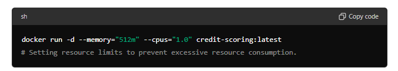
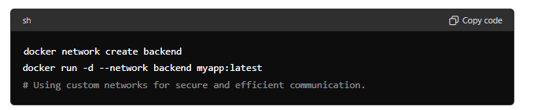
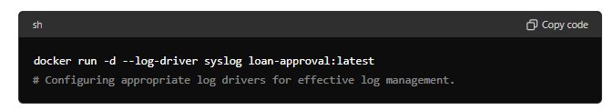
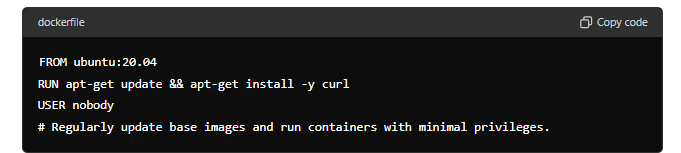
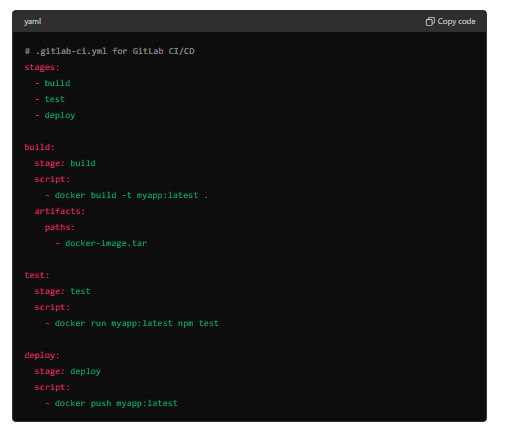
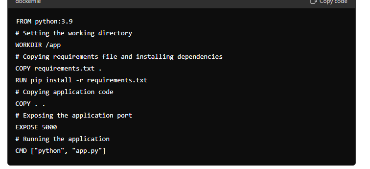

#  Docker Best Practices
# 1. Use Official and Verified Images
* Official Images: Start with official images from Docker Hub when possible, as they are maintained and updated regularly.

* Minimal Base Images: Use minimal base images (like alpine) to reduce the attack surface and image size.

 > simple real case scenario example:

 A banking application requires a MySQL database for storing customer transaction records.

 
Using the official MySQL image ensures regular updates and security patches, crucial for handling sensitive financial data.

# 2. Keep Images Small
Multi-Stage Builds: Use multi-stage builds to minimize the final image size by only including necessary components.
Remove Unnecessary Files: Clean up package lists, cache files, and other unnecessary files to keep the image lean.
 > simple real case scenario example:

 Building a microservice for customer authentication using a minimal base image.The node:16-alpine image is small, reducing the image size and potential vulnerabilities.

 

# 3. Tag Images Properly

Version Tagging: Tag images with version numbers (e.g., myapp:1.0) instead of just using latest to avoid ambiguity and ensure consistency across deployments.

 > simple real case scenario example:

 Deploying a new version of a fraud detection microservice. Tagging the image with fraud-detection:1.0 avoids ambiguity and ensures the correct version is deployed.

 

# 4. Manage Secrets Securely
Environment Variables: Avoid hardcoding secrets in your Dockerfile or image. Use environment variables or Docker secrets for sensitive information.
Docker Secrets: Utilize Docker Swarm or Kubernetes secrets management for secure storage and usage of sensitive data.

> simple real case scenario example:

Storing API keys for payment gateway integration. Using environment variables to handle sensitive information like API keys, ensuring they are not exposed in the image.

# 5. Use Dockerignore
.dockerignore File: Include a .dockerignore file to prevent unnecessary files and directories from being added to the build context, speeding up the build process and keeping the image clean.

> simple real case scenario example:

Building a customer service application. 

# 6. Run as Non-Root User
Non-Root User: Create and run containers with a non-root user to improve security. You can add a user in the Dockerfile using RUN useradd -m myuser and switch to that user with USER myuser.

> simple real case scenario example:

Running a web application to display account statements.  Running the container as a non-root user enhances security by limiting the potential impact of a security breach.

# 7. Optimize Layer Caching
Layer Order: Order your Dockerfile instructions to maximize layer caching. Frequently changing commands should be at the end of the Dockerfile.
Combine Commands: Combine commands where possible to reduce the number of layers, but balance it with readability.

> simple real case scenario example:

Building a transaction processing service. Ordering instructions to maximize layer caching ensures that dependencies are not re-downloaded if only application code changes.

# 8. Leverage Health Checks
Healthcheck: Define HEALTHCHECK instructions in your Dockerfile to allow Docker to monitor the health of your application and take action if it becomes unhealthy.

> simple real case scenario example:

Ensuring the availability of an account management service. The HEALTHCHECK instruction helps monitor the health of the service and take action if it becomes unhealthy.

# 9. Use Volumes for Persistent Data
Volumes: Use Docker volumes to persist data outside of the container’s filesystem, ensuring data is not lost when the container is removed or updated.

> simple real case scenario example:

Storing customer profile images. Volumes ensure that customer profile images are not lost when the container is updated or removed.

Bind Mounts: Use bind mounts for development to sync code changes in real-time.

# 10. Limit Container Resources
Resource Constraints: Set resource limits (--memory, --cpu-shares, etc.) to prevent a single container from consuming excessive resources on the host.

> simple real case scenario example:

Running a credit scoring service with resource constraints. Resource limits prevent the service from consuming too much memory or CPU, ensuring fair resource allocation.

# 11. Network Configuration
Custom Networks: Use custom networks to isolate containers and manage communication more securely and efficiently.

> simple real case scenario example:

Isolating backend services for a banking application.  Custom networks isolate containers, enhancing security and managing communication efficiently.

Service Discovery: Use Docker's built-in DNS service for container name resolution within custom networks.
# 12. Log Management
Log Drivers: Configure appropriate log drivers (json-file, syslog, fluentd, etc.) to manage container logs effectively.
Centralized Logging: Use centralized logging solutions to aggregate and analyze logs from multiple containers and hosts.

> simple real case scenario example:

Aggregating logs from multiple instances of a loan approval service. Using the syslog driver to send logs to a centralized syslog server for aggregation and analysis.

# 13. Security Best Practices
Minimal Privileges: Grant the minimum necessary privileges to your containers.
Regular Updates: Regularly update base images and dependencies to mitigate vulnerabilities.

> simple real case scenario example:

Running a highly sensitive financial transaction service. Regular updates and running with minimal privileges mitigate vulnerabilities.

# 14. Automated Builds and CI/CD Integration
CI/CD Pipelines: Integrate Docker builds into your CI/CD pipelines to automate testing, building, and deployment of images.
Automated Tests: Write and run automated tests to validate your Docker images before deploying them.

> simple real case scenario example:

Automating the build and deployment of a mortgage application. Integrating Docker builds into CI/CD pipelines automates testing, building, and deployment, ensuring consistency and reliability.

# 15. Documentation and Comments
Document Dockerfiles: Comment and document your Dockerfiles to explain the purpose of each instruction, making it easier for others to understand and maintain.

> simple real case scenario example:

Documenting the Dockerfile for an investment portfolio service. 

By following these best practices, you can ensure that your Docker containers are secure, efficient, and maintainable.